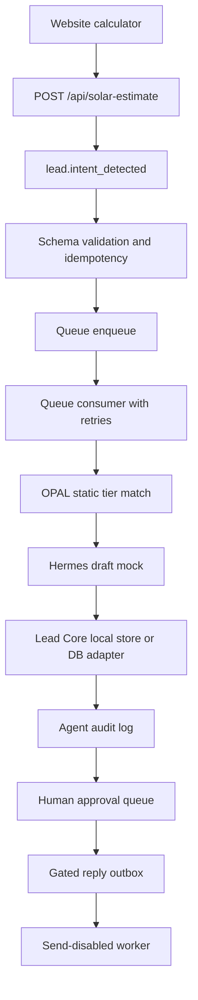
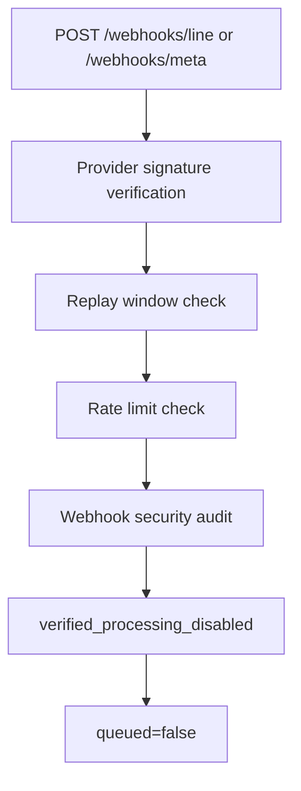
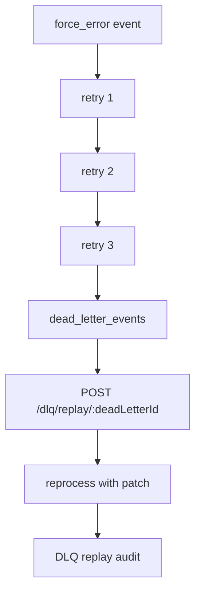

# Workflow Pipeline Map

This document is the operator-facing map for the current local SIRINX Sovereign Agentic Swarm v2.1 pipeline.

It is intentionally read-only:

- no external SaaS writes
- no social auto-replies
- no database mutation
- no secret values printed
- no Bueng Phra public inbound route

## Command

```bash
npm run workflow:pipeline
```

The command prints a JSON report with:

- implemented stages
- end-to-end flows
- redacted readiness state
- blocked production components
- production blockers
- runnable debug commands
- guardrail invariants

## Current Flow



## Security Boundary Flow



## Failure Flow



## Production Rule

Production remains blocked until the report returns `productionReady=true`, a real staging DB dry-run has passed with rollback verification, admin access is behind the approved boundary, and LINE/Meta/LINE OA runtime secrets are configured without printing values.
